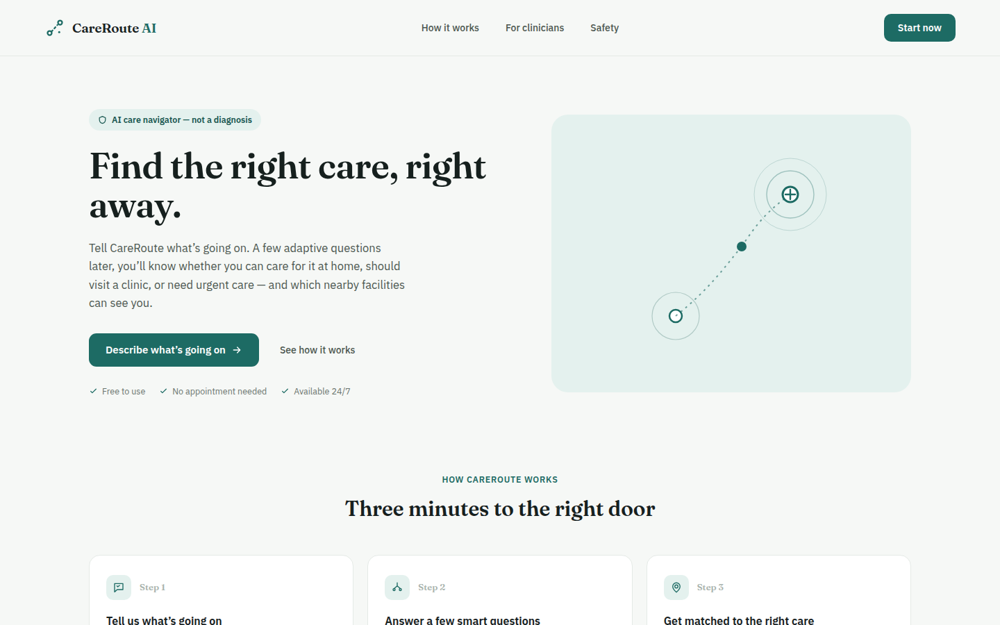
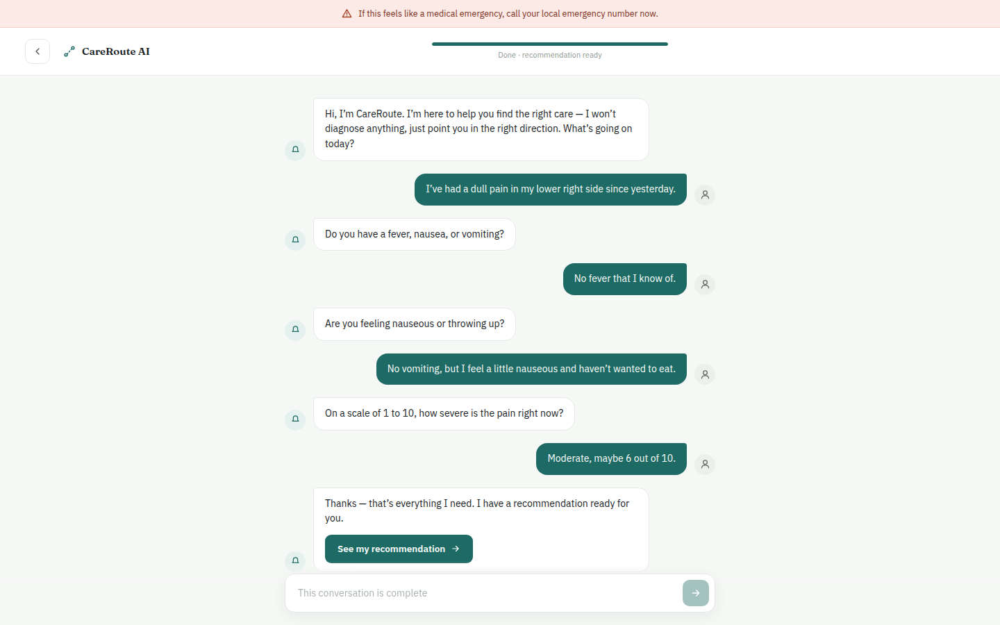
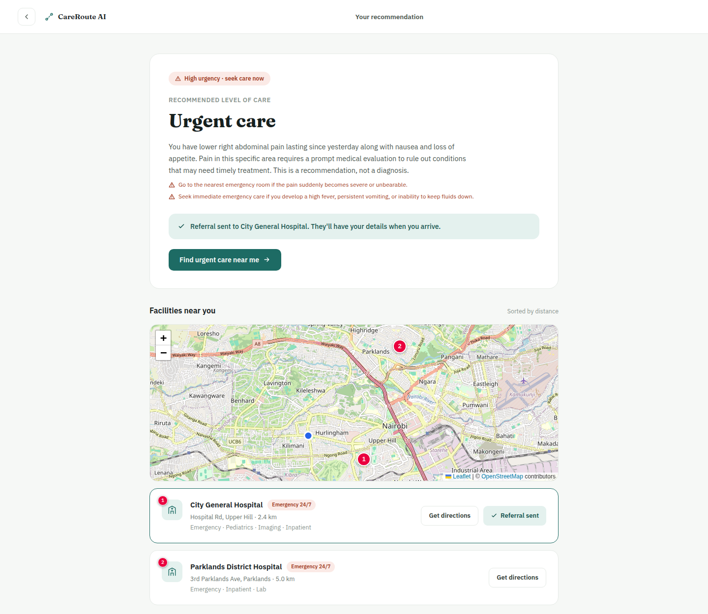
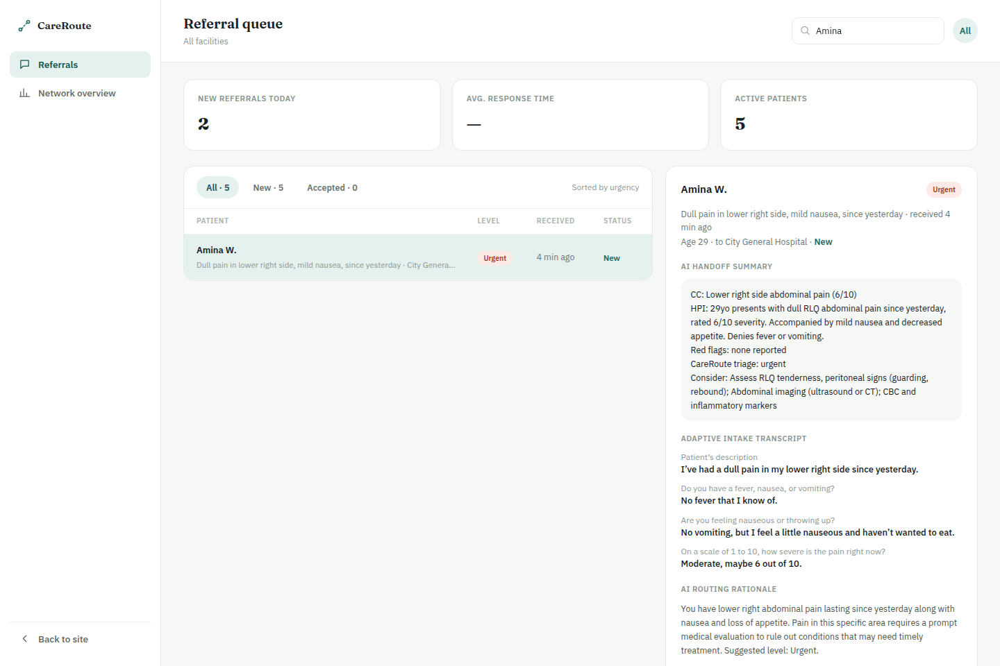
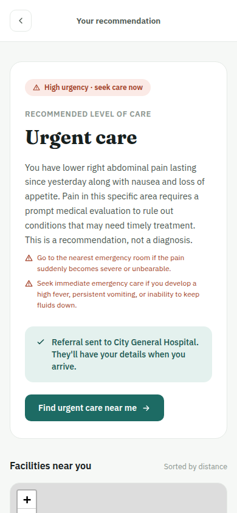
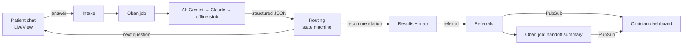
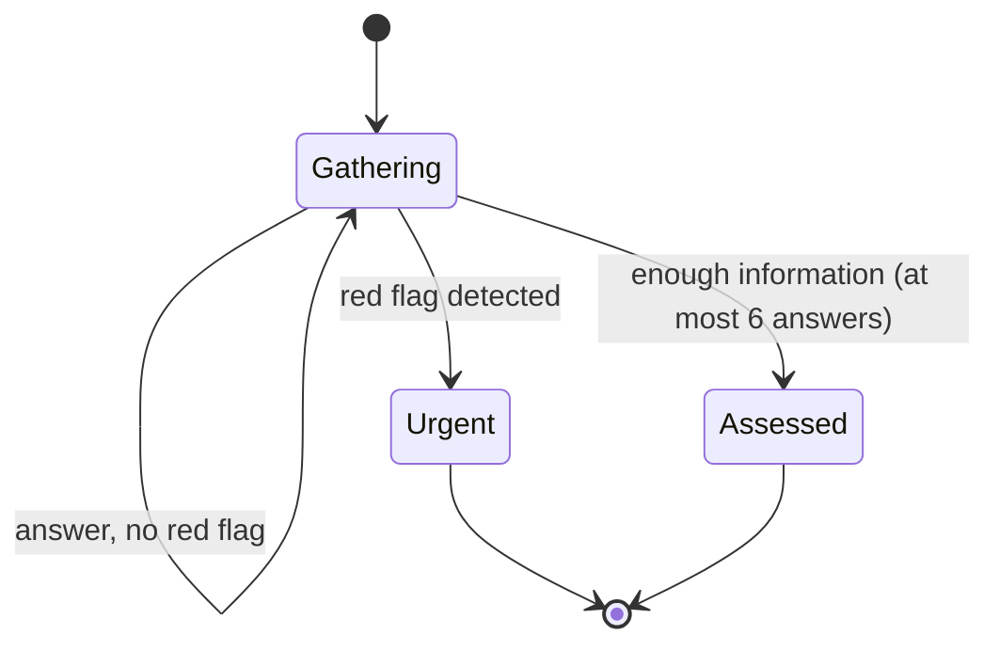

# CareRoute AI

**The AI layer that helps people navigate the healthcare system — not another AI doctor.**

A patient describes what's going on in their own words, by typing or speaking, in English
or Kiswahili. CareRoute asks a few adaptive follow-up questions, then recommends a level
of care — self-care at home, a clinic visit, or urgent care — and shows nearby facilities
on a map. When the patient chooses one, the receiving clinician gets a live referral with
an AI handoff summary, so they can triage in seconds.

## Safety stance: a navigator, not a doctor

- **It never diagnoses.** Every prompt tells the model to route, not to name conditions,
  medications or doses, and every patient screen says so.
- **Danger signs win.** Any red flag (difficulty breathing, chest pain, confusion…) sends the
  patient straight to the urgent pathway, even if the rest of the AI's reply is malformed.
- **The AI extracts; code decides.** The model returns structured JSON only. A
  deterministic state machine (`CareRoute.Routing`) branches on it, and rejects replies it
  can't act on so they're retried instead of guessed.
- **Clinicians see the evidence.** The full intake transcript, the AI's rationale, and which
  answers were spoken (and so may contain speech-recognition errors) travel with every
  referral. AI outputs are stored as given, so a referral shows exactly what was seen at
  handoff time.
- **Emergency first.** The chat keeps an emergency banner in view, and the results page
  repeats the advice to call emergency services if symptoms worsen.

## What it looks like

| Symptom chat | Recommendation and facilities |
|---|---|
|  |  |

The recommendation page on a phone:

*Screenshots are from a real run against Gemini. Facility names are simulated; their
locations are real Nairobi neighbourhoods.*

## Features

**Patients** (`/`, `/start`, `/intake/:token`, `/intake/:token/results`)
- Adaptive chat with a progress bar, in English or Kiswahili
- Voice answers through the browser's speech recognition, reviewed before sending
- Recommendation with reasoning and warning signs
- Nearby facilities on a map, sorted by distance (the device's location when shared),
  with directions and one-tap referral
- Unguessable conversation links; a clear notice with **Try again** if the AI is unreachable

**Clinicians** (`/clinician`, behind a staff login)
- Live referral queue sorted by urgency, with search, status tabs and new-arrival highlights
- AI handoff summary, the question-and-answer transcript, and the routing rationale
- Accept → complete, or reassign to another facility; response-time stats
- "View as" a clinician to see only their facility's referrals

**Network** (`/admin`, behind the staff login) — routing counts and load per facility.

## How it works

Each patient answer queues one AI call that returns the intake JSON contract:
what's been learned so far, any red flags, and the next step
(`ask_question`, `escalate_urgent` or `ready_for_recommendation`).

| Context | Module | Role |
|---|---|---|
| Intake | `CareRoute.Intake` | Patients, conversations, transcript, symptom reports |
| Routing | `CareRoute.Routing` | Validates AI replies and decides the next step |
| Referrals | `CareRoute.Referrals` | Referrals, stats, and the `referrals` PubSub topic |
| Facilities | `CareRoute.Facilities` | Facility directory, distances, clinicians |
| AI | `CareRoute.AI` | One entry point for structured AI calls |

**AI providers.** `CareRoute.AI.generate/4` uses Gemini when `GEMINI_API_KEY` is set
(structured output, falling back across the models in `config :care_route, :gemini` when
one is overloaded), otherwise Claude when `ANTHROPIC_API_KEY` is set (forced tool use),
otherwise an offline stub that returns the same contract — so the whole app, and the test
suite, run without any key. Failed calls retry quickly; after the last attempt the patient
sees a notice and the clinician sees "Summary unavailable", each with a retry button.

**Stack.** Phoenix 1.8 + LiveView, Ecto/PostgreSQL, Oban, Req, Tailwind + daisyUI,
Leaflet with OpenStreetMap tiles.

## Running locally

    mix setup                        # deps, database, migrations, seeds, assets
    set -a; . ./.env; set +a         # optional: GEMINI_API_KEY, STAFF_USERNAME, STAFF_PASSWORD
    mix phx.server                   # http://localhost:4000

- `/clinician` and `/admin` use basic auth from `STAFF_USERNAME` / `STAFF_PASSWORD`.
  They're required in production; in development the pages are open if unset.
- Before a demo rehearsal, `mix care_route.demo_reset --yes` clears all patient data and
  reseeds facilities (without `--yes` it only shows what it would delete).
- `mix test` runs the suite (offline stub, no keys needed); `mix precommit` also checks
  formatting and compiler warnings.

## Deploying (Fly.io)

The repo has a production release and `Dockerfile` (`mix phx.gen.release --docker`).
A local production build has been checked end to end: migrate, seed, boot, login.

    fly launch --no-deploy            # detects the Dockerfile; say yes to Postgres
    fly secrets set \
      SECRET_KEY_BASE=$(mix phx.gen.secret) \
      GEMINI_API_KEY=... \
      STAFF_USERNAME=... STAFF_PASSWORD=...
    fly deploy

In `fly.toml`, run migrations on every deploy:

    [deploy]
      release_command = "/app/bin/migrate"

Then seed the facility directory once (safe to re-run):

    fly ssh console -C '/app/bin/care_route eval "CareRoute.Release.seed()"'

Set `PHX_HOST` to the app's hostname (e.g. `care-route.fly.dev`). Phones only allow the
microphone (voice answers) and location (nearest facilities) over HTTPS, which Fly provides.

## Known limitations

- **Simulated facilities.** Names, services and addresses are illustrative; swap in a real
  directory via `priv/repo/seeds.exs`. Opening hours and wait times aren't modelled.
- **Voice privacy.** Speech recognition runs in the browser; Chrome sends audio to Google's
  speech service. Browsers without the Web Speech API (e.g. Firefox) show typing only.
- **Rate limits.** Gemini's free tier allows 5 requests per minute per model; use a paid key
  for a live demo.

**Demo backup plan.** With both `GEMINI_API_KEY` and `ANTHROPIC_API_KEY` set, a failed
Gemini call is retried on Claude automatically. If the network or AI services are down,
set `AI_PROVIDER=stub` and restart: the whole flow keeps working on the offline stand-in
(`gemini` or `claude` force those providers instead).
- **Not a medical device.** CareRoute is a hackathon prototype for navigation, not clinical
  decision-making.

Built for DSH Hacks V2.
